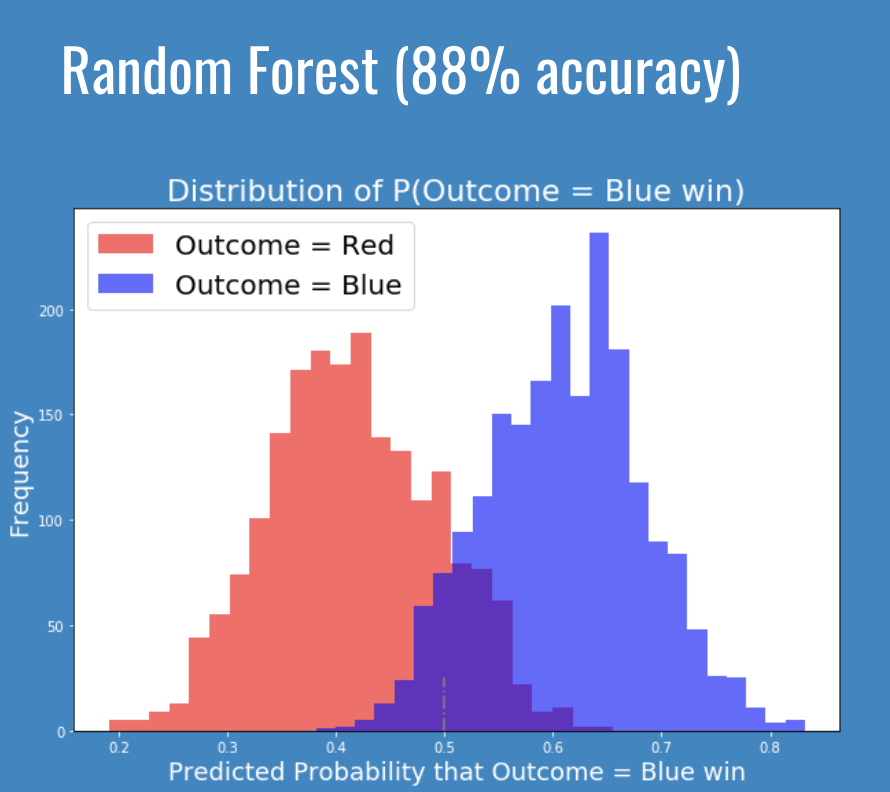

# Determining "first blood" in a game.
---
## Problem Statement
---
Our problem is to determine chances of success to a 5 versus 5 online strategy game. To put simply in a vastly different but comparable example, can we determine the results of a round of rock paper scissors if I have both players’ selected options?  For instance, given the fact that player A has selected paper and player B has selected scissor, we can provide you 100% certainty that player B will win.  But that’s not all there is to it right?  This IS a 5 versus 5 game that has been popular globally in the “esports” scene. 

Our goal is to create a model for which we can refer back to when we decide to place a bet on a betting site. This is essentially gambling. Ideally, with the model that we create, we can use the probabilities to help us decide which team to bet on.

---
## Why the gaming community?
---
But why do we care about the gaming industry? One of the most important reasons is the industry’s annual revenues.  These are huge numbers that keep growing.  Also, according to esportsbets.com, over 8 billion USD had been wagered on esports match results.  Thanks to Statista, we’re able to take a look at our demographics of video game players.  As you can see here, while our majority of gamers sit between the 18 to 35 age range, approximately a fifth of our gamers are actually 50 and older!

https://venturebeat.com/2020/01/02/superdata-games-hit-120-1-billion-in-2019-with-fortnite-topping-1-8-billion/
https://www.esportsbets.com/news/over-8-billion-wagered-on-esports-2019/
https://www.statista.com/statistics/189582/age-of-us-video-game-players-since-2010/

---
## What game?
---
Our evaluated game’s developer is Riot Games.  Many of those who recognize this company would immediately think of their popular online title, League of Legends.  One key thing to recognize here is their 44 million concurrent viewers during an international tournament.  We’re talking about a LOT of viewers. And potentially a LOT of betters!

https://rankedkings.com/blog/how-many-people-play-league-of-legends
https://dotesports.com/league-of-legends/news/league-of-legends-2019-worlds-peak-viewership

* Game developer and publisher
* 2500+ employees
* 20+ offices worldwide
* Fortune’s “100 best companies to work for”
* Estimated 115 million players worldwide
* 2019’s largest international tournament peaked at 44 million concurrent viewers

---
## What is League of Legends?
---
Just as a very simple walk-through to understand what kind of game we’re looking at...League of Legends is a multiplayer, real time strategy game.  Our 10 players are pit against each other in a 5 versus 5, “destroy the opponent’s main structure” game. Players can select from 148 different ingame characters, 2 out of 10 spells and 495 possible combinations of abilities or perks to enhance their character. As you can imagine, there are tons of permutations just from characters and skills you can choose from during the pregame selections.  Also, just as a side note, the winning team/organization in our 2018 worlds championship received $2.4 million USD!

---
## Steps
---
The steps we take will obviously start off with our data collection through the Riot Games API.  Many parameters had to be taken into account. The most important ones are that these matches MUST be ranked matches. Meaning that these matches have weight to them. Winners gain points and losers lose points. This ladder system is how players receive rewards provided by Riot Games and how organizations pick up their newest addition.  Plainly speaking, if you do well enough and get recognized, you can make a good amount of money from playing competitively or streaming online.  We also need to account for players’ skill in being able to climb this ladder. Hence, we will only look at the top 4 ranked titles that the players are labeled under.

Our second step is much easier.  We simply remove all fields of data pertaining to ingame and post game details.  These are data that we would never be supplied with.  For example, there’s no betting or predicting if I tell you that I’m going to choose “rock” prior to our rock paper scissors match.  Also, if everyone on one team outperforms every player on the other team by 10 folds, it would be clear as day as to who had claimed victory over the other. Lastly, this could also mean that one team was heavily outclassed in terms of their ability to play the game.

---
## How our data looks
---
| blue team first kill | player 1 character | player 1 spells | ... | player 10 spells |
|----------------------|--------------------|-----------------|-----|------------------|
| 1                    | some string        | some string     | ... | some string      |
| 0                    | some string        | some string     | ... | some string      |
| 0                    | some string        | some string     | ... | some string      |
| 1                    | some string        | some string     | ... | some string      |
| 1                    | some string        | some string     | ... | some string      |
| 0                    | ...                | ...             | ... | ...              |
| 1                    | some string        | some string     | ... | some string      |

Our data essentially has string values all across the board. Because of these categorical values, pd.get_dummies ends up giving us over 3000 columns. Thankfully, we still have about 12-13 thousand more rows than we do columns!

---
## Our best model's perfomance
---

---
## Scores
---
|                       | Test score | Log loss |
|-----------------------|------------|----------|
| Logistic Regression   | .8         | .53      |
| Bernoulli Naive Bayes | .67        | .83      |
| Neural Networks       | .87        | .35      |
| Random Forest         | .88        | .51      |

Our last and most appealing model of them all is random forest.  This model has brought us a very ideal “percent chance of winning” distribution of data. This model gives us a good idea of where and when we should place a bet for a team. As you can see on the graph, misclassification practically ceases to exist below the .38 and above the .65 mark. Our model’s prediction confidence here is definitely something we can look at and agree with. Percentages between .4 and .6 essentially come down to a coin flip.  

---
## Some findings
---
Initially, I had accidentally included all game modes into the dataset. This resulted in terrible models that averaged around .52.  It is crucial to be certain that the game mode used is the ladder/ranked match. Secondly, due to the nature of the data set we’re working with, we’re very limited to what we can do with the data set. For example, you cannot create interaction terms and you wouldn’t really be able to interpret what KNN would be doing to the model.  As for the coefficients, while we do have a logistic regression model, we cannot take them too seriously because of certain categorical features that have an innate relationship with other categorical features.  For example, we know that sometimes a character is a lot more effective in a game when paired with another specific character. Further Bayesian analysis would be required.

---
## Next steps
---
* Moving forward, I’d definitely continue with using Random Forest as my go to model.  It makes sense that the model does not give out results such as, “1.0 chance for blue team to get the first kill”. Also, it splits our values properly. We visually expect two distributions to be split from one large distribution and have the overlapping or misclassified data points to be near the center. And Random Forest does exactly that. I wouldn’t have to worry about the large outliers that the other models had provided me. 
* Another goal is the creation of a web page application.  This can possibly become a “paid for” app that users can benefit from using machine learning to help elevate their chances of winning bets. 
* Third, requesting for an API key from Riot Games.  Data collection was a giant bottleneck considering I was essentially only able to collect 10 game observations every 2 minutes. This took forever and limited my ability to actually collect my desired data size. 
* Lastly, Bayesian inference would be another layer of statistical analysis that this predictor could benefit from. Currently, we’re just looking at team compositions.  But obviously, when we look at Riot Games’ sanctioned tournaments, we’re looking at professional teams playing each other. Some teams outclass others by a wide margin.  But many of these teams also have a history ranging up to 10 years.  Collecting this data will without a doubt take a good amount of time.
